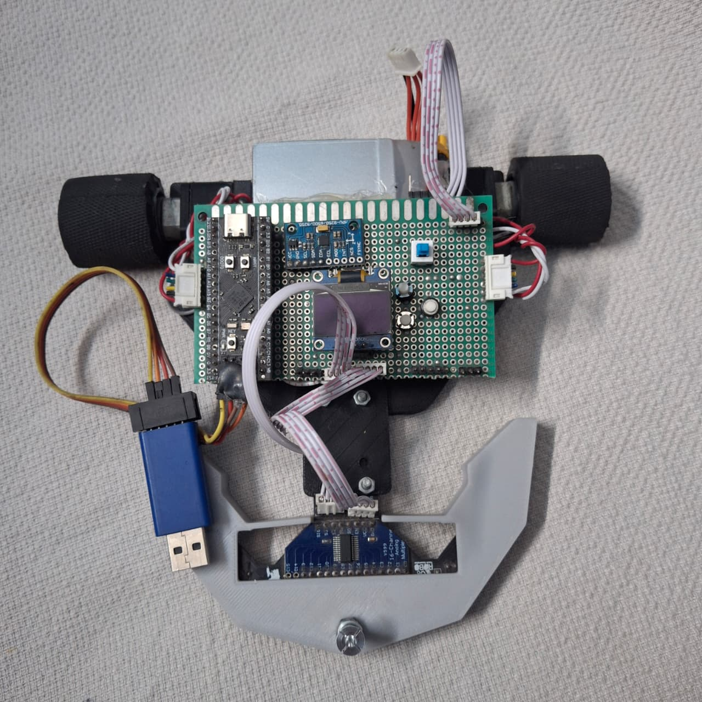
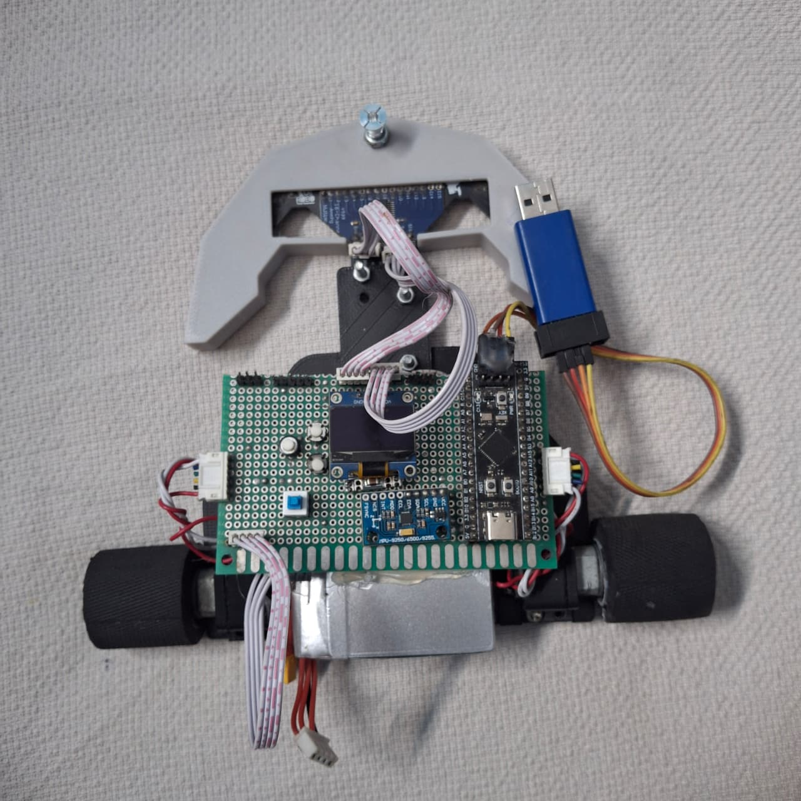

# BP-Line-Follower

A 14-IR sensor array based Line Follower built for competitive line and wall following.

  
  

## Results

| 🥇 Gold | 🥈 Silver | 🥉 Bronze |
|:-------:|:---------:|:---------:|
| 1 | 1 | 2 |

| Event | Result | Year |
|-------|--------|------|
| IUT Accelerate | 1st | 2025 |
| Traction | 2nd Runner-up | 2025 |
| KUET Ignition | 1st Runner-up | 2026 |
| WRO Future Engineers Nationals | Bronze Medalist | 2026 |

## Hardware

- **Microcontroller**: STM32F411CE
- **Motor Driver**: BTS7960
- **IMU**: MPU9250 9-Axis Attitude Gyro Accelerator Sensor Module
- **Buck Converter**: Mini MP1584EN DC-DC Buck 5V Step Down Module
- **Battery**: 3S LiPo
- **Motors**: 16 GA DC Gear Motors
- **Sensors**: 14 array IR sensor
- **MUX**: 74HC4067 16-Ch Analog/Digital Mux Module

## Software

Programmed in Arduino IDE.

## License

MIT, see [LICENSE](LICENSE).
